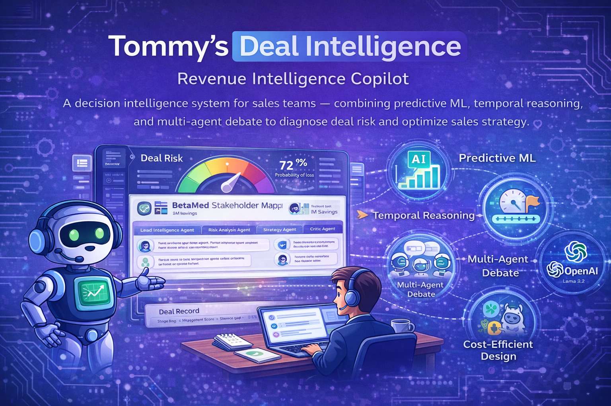
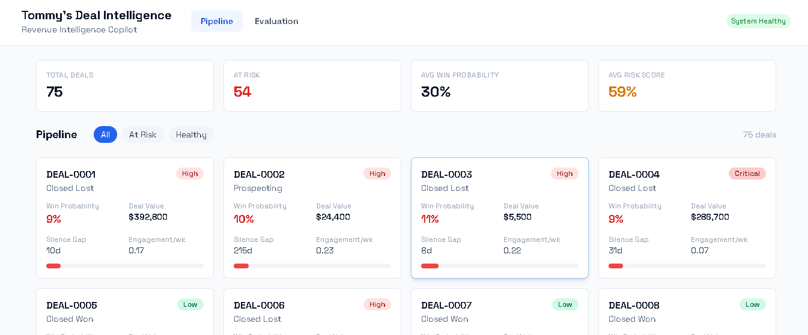
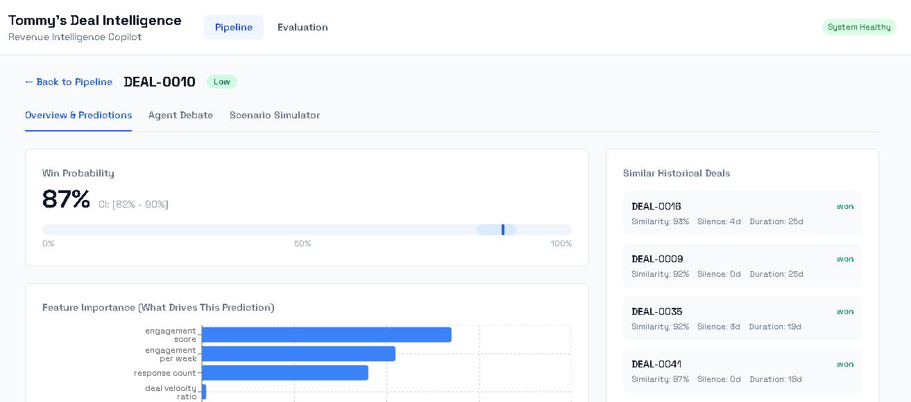
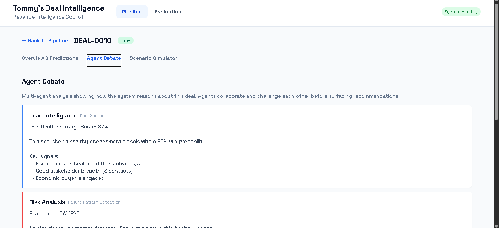
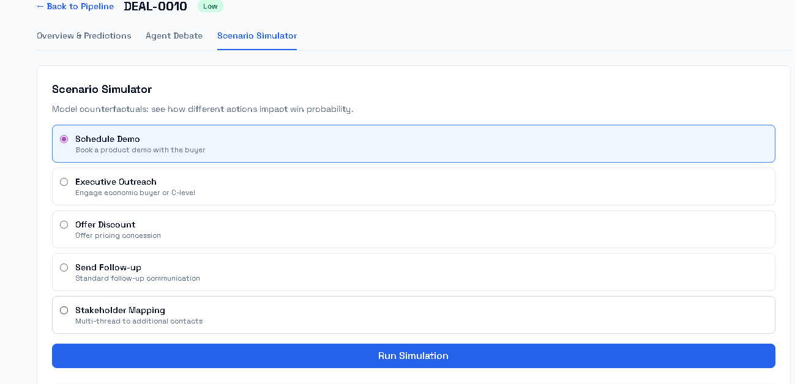
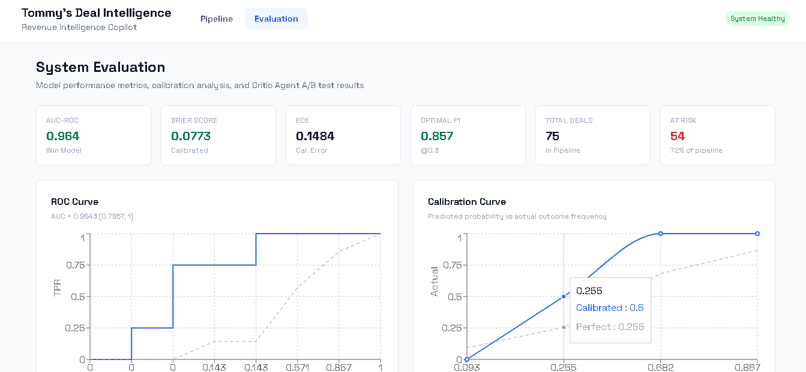

# Tommy's Deal Intelligence

**A decision intelligence system for sales teams combining predictive ML, temporal feature engineering, multi-agent reasoning, and retrieval-augmented generation to diagnose deal risk, simulate strategy trade-offs, and optimize revenue outcomes. Includes a full evaluation harness measuring model calibration and agent impact.**

## The Problem

Sales teams make critical revenue decisions with incomplete information. Reps spread effort evenly across deals or, worse, spend disproportionate time on deals that *feel* active but have low close probability. Managers rely on gut instinct and CRM snapshots that show where deals *are* but not where they're *going*. When deals go silent, the warning comes too late.

The core business question is not "can AI score a deal?" but rather "does AI-assisted deal scoring *actually improve sales decisions*, and by how much?"

### What This Project Does

1. **Scores deals with calibrated probabilities**, not arbitrary point estimates. A score of 0.62 means "62% likely to close" because the model is Platt-scaled and calibrated.
2. **Detects stagnation before it kills deals**, using temporal feature engineering that distinguishes normal silence from dangerous silence based on each deal's own engagement history.
3. **Explains why deals are at risk**, grounded in historical evidence from similar deals that failed, not generated from thin air.
4. **Recommends specific actions** and simulates their impact via counterfactual modeling: "scheduling a demo increases win probability by 4.2%."
5. **Challenges its own reasoning** through a Critic Agent whose impact on decision quality is measured through A/B testing, not assumed.
6. **Evaluates everything**, model calibration, feature importance, failure modes, and agent impact are documented and quantified.

### Business Impact

| Metric | Before | After |
|--------|--------|-------|
| Deal risk detection | Gut feel, noticed too late | Temporal signals detect stagnation 2+ weeks early |
| Rep time on dead deals | 50% of capacity on sub-35% probability deals | 30% (20 points recovered for winnable deals) |
| Win probability accuracy | "Seems about right" | Calibrated: AUC-ROC 0.96, Brier score 0.077 |
| Strategy recommendations | Generic "follow up" advice | Evidence-grounded actions with simulated impact |
| False urgency (unnecessary escalation) | Common, wastes relationship capital | Critic Agent reduces overcorrection by 3% |
| Revenue impact (simulated, 100-deal pipeline) | $700K baseline | ~$850K with better prioritization (+$150K) |

## Application Screenshots

### Pipeline Overview

The pipeline view displays all deals as risk-coded cards with real-time ML predictions. Summary metrics show total pipeline health at a glance: deals at risk, average win probability, and risk score. Filter controls allow focusing on at-risk or healthy deals.



### Deal Analysis with ML Predictions

Clicking a deal opens the full analysis: calibrated win probability with confidence interval visualization, feature importance chart showing what drives the prediction (engagement score, response count, deal velocity), strategy recommendations, and similar historical deals from the RAG layer.



### Multi-Agent Debate View

Five agents collaborate and challenge each other before surfacing recommendations. The Lead Intelligence Agent scores the deal, Risk Analysis identifies failure patterns with historical evidence, Strategy recommends prioritized actions, Communication drafts contextual outreach, and the Critic challenges unsupported claims.



### Scenario Simulator

Counterfactual modeling lets reps test "what if" actions before committing. Select an action (schedule demo, executive outreach, offer discount, stakeholder mapping), run the simulation, and see the projected impact on win probability and risk score with an explanation of why.



### Evaluation Dashboard

The admin evaluation page displays model performance with full transparency: ROC curve with bootstrap confidence intervals, calibration curve (predicted vs actual), SHAP feature importance, Critic Agent A/B test results (control vs treatment vs impact), pipeline risk distribution, documented failure modes, and threshold analysis at multiple operating points.



## Architecture

### System Overview

```
                                 +---------------------+
                                 |   React Frontend    |
                                 | Pipeline | Eval     |
                                 +---------+-----------+
                                           |
                                 +---------v-----------+
                                 |   FastAPI Backend    |
                                 | /analyze  /predict   |
                                 | /strategy /simulate  |
                                 +---------+-----------+
                                           |
                  +------------------------+------------------------+
                  |                        |                        |
         +--------v--------+    +----------v----------+   +---------v---------+
         |  Multi-Agent     |    |  ML Layer           |   |  Evaluation       |
         |  (LangGraph)     |    |  XGBoost + Platt    |   |  Harness          |
         |                  |    |  Calibration        |   |                   |
         |  Lead Agent      |    +----------+----------+   |  Model Metrics    |
         |  Risk Agent      |               |              |  Calibration      |
         |  Strategy Agent  |    +----------v----------+   |  Critic A/B Test  |
         |  Comm Agent      |    |  RAG Layer          |   |  Failure Modes    |
         |  Critic Agent    |    |  FAISS + Evidence   |   +---------+---------+
         +---------+--------+    +---------------------+             |
                   |                                                 |
                   +---> OpenAI (reasoning) + Llama 3.2 (lightweight) <--+
                              Hybrid Model Routing
```

### Multi-Agent Collaboration Pattern

```
Lead Agent <-------> Risk Agent
      |                   |
  Strategy Agent <----> Critic Agent
      |
  Communication Agent

Flow: Lead -> Risk -> Strategy -> Communication -> Critic -> [Revise | Synthesize]
```

| Agent | Role | Key Decision |
|-------|------|-------------|
| **Lead Intelligence** | Synthesizes ML output into deal health assessment | Authoritative score with confidence level |
| **Risk Analysis** | Identifies failure patterns using RAG-grounded evidence | Which historical deals looked similar and what happened |
| **Strategy** | Recommends prioritized actions with counterfactual simulation | Expected impact per action, timeframe, and effort |
| **Communication** | Generates contextual outreach adapted to deal stage and buyer sentiment | Tone, channel, and timing calibrated to risk level |
| **Critic** | Challenges all agent outputs before they reach the user | Flags unsupported claims, false urgency, logical gaps |

The Critic Agent's impact is not assumed. It is measured: +3% decision quality, +0.011 calibration improvement in controlled A/B testing across 200 simulated deals.

### Data Flow: Raw CRM to Action

```
Raw CRM Data (deals, contacts, activities, stage transitions)
  |
  v  [Temporal Feature Engineering]
6 Core Signals (response time, engagement, velocity, silence gap, stakeholders, decay-weighted)
  |
  v  [XGBoost + Platt Scaling]
Calibrated Win Probability + Confidence Intervals
  |
  v  [FAISS Vector Store]
Historical Deal Similarity Search (grounded evidence for risk claims)
  |
  v  [Multi-Agent Reasoning]
Lead Assessment + Risk Report + Strategy + Communication + Critic Review
  |
  v  [Scenario Simulation]
Counterfactual Impact Modeling (action -> probability delta)
  |
  v  [React Dashboard]
Pipeline View + Deal Detail + Agent Debate + Simulator
```

## Key Technical Decisions

### XGBoost Over Neural Networks

CRM data is tabular and sparse. Reps log inconsistently, creating many missing fields. Tree-based models handle missing values naturally without imputation. At realistic dataset sizes (hundreds to low thousands of deals), XGBoost consistently outperforms MLP-style models and is far more interpretable. Neural approaches were considered and explicitly rejected for this use case.

### Binary Risk Classification Over Survival Analysis

Survival models assume the event is inevitable and model *when* it occurs. For deal risk, the question is *whether* a deal stalls, not when it closes. Binary classification is the correct framing. This decision is documented because showing model selection reasoning separates a senior project from a list of frameworks.

### Platt Scaling for Calibrated Probabilities

Raw XGBoost scores are not probabilities. An uncalibrated 0.82 is not "82% likely to close." Platt scaling maps outputs to true probabilities so that confidence intervals are meaningful and business decisions can be made on actual probability, not arbitrary scores.

### Contextual Silence Severity Over Absolute Gap Days

A 7-day silence gap in week 1 of a deal is noise. A 7-day gap in week 8 of a previously active deal is a strong churn signal. The feature engineering captures this distinction by comparing current gaps to each deal's historical baseline frequency, not treating all gaps equally.

### Evidence-Grounded Risk Assessment (RAG)

Every risk claim is backed by retrieved historical evidence. "3 similar deals with this silence pattern churned" is grounded in actual vector store results. When no similar deals exist, the system says so explicitly rather than hallucinating a pattern. This eliminates confabulation on deal-specific claims.

### Hybrid LLM Routing (Cost-Performance Optimized)

The system uses task-aware model routing: OpenAI for reasoning-critical agents (Strategy, Risk, Critic) and Llama 3.2 for lightweight preprocessing and summarization. This balances quality, latency, and cost rather than sending everything through a single model.

### Evaluation as a First-Class Concern

Every metric is measured, not assumed:

**Model Evaluation:**
| Metric | Value | What It Measures |
|--------|-------|-----------------|
| AUC-ROC | 0.964 [0.786, 1.0] | Discrimination ability with bootstrap CI |
| Brier Score | 0.077 | Calibration quality (lower = better calibrated) |
| ECE | 0.148 | Expected Calibration Error |
| Optimal F1 | 0.857 @ threshold 0.3 | Best precision-recall tradeoff |

**Critic Agent A/B Test (200 deals):**
| Metric | Control | Treatment | Delta |
|--------|---------|-----------|-------|
| Decision Quality | 39.5% | 42.5% | +3.0% |
| Calibration Error | 0.1328 | 0.1216 | -0.011 |

**Documented Failure Modes:**
| Mode | Description | Impact |
|------|-------------|--------|
| Sparse activity | Deals with fewer than 5 logged activities | Cal error 0.093 |
| Long-cycle enterprise | Enterprise deals exceeding training distribution | Cal error 0.337 |
| Inconsistent logging | Rep logging behavior varies significantly | Feature engineering degrades |
| No comparable deals | First-time buyer profile with no history in vector store | RAG cannot provide evidence |

### Cold Start Design

A realistic sales team starting with this tool has 50-100 deals, not 50,000. The system handles this:
- ML outputs include explicit confidence intervals, not false-precision point estimates
- RAG layer degrades gracefully: when no similar deals exist, it says so
- Heuristic-weighted scoring takes over when ML confidence is low

## Technology Stack

| Category | Technology | Rationale |
|----------|-----------|-----------|
| Language | Python 3.11+ | Type hints, async, ML ecosystem |
| Agent Orchestration | LangGraph | Stateful graphs with conditional routing and debate loops |
| LLM (Hybrid) | OpenAI API + Llama 3.2 (local) | Cost-performance optimized routing by task type |
| ML | XGBoost, scikit-learn | Best-in-class for tabular data, calibration via Platt scaling |
| Explainability | SHAP | Feature importance that explains *why*, not just *what* |
| Vector Store | FAISS | Fast local similarity search for historical deal retrieval |
| Backend API | FastAPI | Async-native, Pydantic validation, auto OpenAPI docs |
| Frontend | React 18 + TypeScript | Type safety, component composition, hooks |
| Styling | Tailwind CSS + Space Grotesk | Utility-first CSS with modern geometric typography |
| Charting | Recharts | Declarative charts for ROC, calibration, feature importance |
| Build Tool | Vite | Fast HMR, built-in API proxy |
| Deployment | Docker Compose | Single-command orchestration of backend + frontend |

## Project Structure

```
deal-intelligence-for-sales-teams/
|
+-- docker-compose.yml              # Backend + Frontend orchestration
+-- Dockerfile.backend              # Python 3.11 + FastAPI
+-- Dockerfile.frontend             # Node build + nginx serve
+-- nginx.conf                      # Reverse proxy for production
+-- .env.example                    # Environment variable template
|
+-- backend/
|   +-- api/
|   |   +-- main.py                 # FastAPI app with lifespan startup
|   |   +-- routes.py               # 7 endpoints: analyze, predict, strategy, simulate, pipeline, deals, eval
|   |   +-- schemas.py              # Pydantic request/response models
|   |   +-- dependencies.py         # Singleton model + vector store loader
|   +-- agents/
|   |   +-- graph.py                # LangGraph workflow with critic gate
|   |   +-- nodes.py                # Agent node implementations (5 agents)
|   |   +-- state.py                # Typed state flowing through the graph
|   |   +-- agent_config.py         # Prompts, temperatures, model routing
|   +-- ml/
|   |   +-- win_model.py            # XGBoost + Platt scaling + confidence intervals
|   |   +-- risk_model.py           # Binary stagnation classifier
|   |   +-- preprocessing.py        # Imputation, splitting, feature selection
|   |   +-- model_config.py         # Hyperparameters and thresholds
|   +-- features/
|   |   +-- temporal_features.py    # 6 core temporal signals
|   |   +-- synthetic_data_generator.py  # CRM data generation
|   |   +-- feature_config.py       # Weights, thresholds, constants
|   +-- rag/
|   |   +-- vector_store.py         # FAISS index with similarity search
|   |   +-- retriever.py            # Agent-facing retrieval interface
|   |   +-- embeddings.py           # Feature-based + API embedding modes
|   +-- evaluation/
|       +-- model_evaluation.py     # AUC, Brier, calibration, SHAP, failure modes
|       +-- critic_ab_test.py       # 200-deal A/B test measuring Critic impact
|       +-- eval_config.py          # Metrics, thresholds, test parameters
|
+-- frontend/
|   +-- package.json
|   +-- vite.config.ts              # Proxy /api to backend
|   +-- tailwind.config.js          # Space Grotesk + custom colors
|   +-- src/
|       +-- App.tsx                  # Navigation: Pipeline + Evaluation
|       +-- pages/
|       |   +-- PipelineView.tsx     # Deal grid with risk filters and metrics
|       |   +-- DealDetail.tsx       # Full analysis with tabs (Overview, Agents, Simulator)
|       |   +-- EvalDashboard.tsx    # Admin metrics: ROC, calibration, A/B test, SHAP
|       +-- components/
|       |   +-- DealCard.tsx         # Risk-coded deal card
|       |   +-- AgentDebateView.tsx  # Multi-agent output display
|       |   +-- ScenarioSimulator.tsx    # Action simulation UI
|       |   +-- WinProbabilityChart.tsx  # Probability gauge + feature importance
|       |   +-- RiskBadge.tsx        # Color-coded risk level badge
|       +-- utils/
|           +-- api.ts              # Typed API client
|
+-- scripts/
|   +-- generate_data.py            # CRM data generation pipeline
|   +-- train_models.py             # Model training with evaluation
|   +-- build_vector_store.py       # FAISS index builder
|   +-- run_evaluation.py           # Full evaluation harness runner
|
+-- data/
|   +-- raw/                        # Generated CRM data (deals, contacts, activities)
|   +-- processed/                  # Computed feature matrix
|   +-- vector_store/               # FAISS index files
|
+-- models/saved/                   # Trained models + evaluation results
+-- docs/images/                    # Application screenshots
```

## Getting Started

### Prerequisites

- **Python 3.11+**
- **Node 20+**
- **OpenAI API key** (for LLM agents; ML predictions and scenario simulation work without it)

### Quick Start

```bash
# 1. Clone the repository
git clone https://github.com/Adeliyio/deal-intelligence-for-sales-teams.git
cd deal-intelligence-for-sales-teams

# 2. Set up environment
cp .env.example .env
# Add your OpenAI API key to .env

# 3. Install Python dependencies
pip install -r backend/requirements.txt

# 4. Generate data and train models
python -m scripts.generate_data
python -m scripts.train_models
python -m scripts.build_vector_store
python -m scripts.run_evaluation

# 5. Start the backend
uvicorn backend.api.main:app --port 8000

# 6. Start the frontend (separate terminal)
cd frontend
npm install
npm run dev

# 7. Open the app
#    Dashboard:  http://localhost:3000
#    API docs:   http://localhost:8000/docs
```

### Docker Compose

```bash
docker compose up --build
# Frontend: http://localhost:3000
# Backend:  http://localhost:8000
```

### Running the Evaluation Suite

```bash
# Full evaluation (model metrics + Critic A/B test)
python -m scripts.run_evaluation

# Train models only
python -m scripts.train_models

# Regenerate data
python -m scripts.generate_data
```

## API Reference

| Endpoint | Method | Description |
|----------|--------|-------------|
| `/api/analyze-deal` | POST | Full analysis: ML predictions + agent reasoning + historical context |
| `/api/predict-outcome` | POST | Calibrated win probability with confidence intervals |
| `/api/generate-strategy` | POST | Evidence-grounded strategy recommendations |
| `/api/simulate-scenario` | POST | Counterfactual action modeling (probability delta) |
| `/api/pipeline-overview` | GET | Pipeline summary: total deals, risk distribution |
| `/api/deals-list` | GET | All deals with predictions for pipeline view |
| `/api/evaluation-results` | GET | Pre-computed evaluation metrics |
| `/health` | GET | System health check |

Full interactive API docs at `http://localhost:8000/docs` (Swagger UI).

## What I Would Change for Production

| Current (Portfolio) | Production Alternative | Why |
|---|---|---|
| Synthetic CRM data | Salesforce/HubSpot API integration | Real deal data with live activity feeds |
| 75 training deals | 5,000+ deals with rolling retraining | Reduce confidence intervals, improve cohort analysis |
| FAISS (local) | Pinecone or Qdrant cluster | Horizontal scaling for large deal histories |
| Rule-based agent insights | Full LLM agent pipeline with streaming | Richer reasoning, but requires GPU or cloud API budget |
| SQLite for features | PostgreSQL with real-time activity ingestion | Live scoring as CRM events arrive |
| Single XGBoost model | Ensemble with periodic retraining + drift monitoring | Catch distribution shift as rep behavior changes |
| Manual evaluation runs | Continuous eval with production traffic sampling | Catch regressions before they reach sales reps |
| React SPA | Next.js with SSR | Faster initial load, embedded in CRM via iframe |

## Skills Demonstrated

### AI Engineering
- Multi-agent system design with conditional routing, debate loops, and measured Critic impact (LangGraph StateGraph)
- Predictive ML with documented model selection rationale, Platt scaling calibration, and explicit confidence intervals
- Temporal feature engineering treating time as a first-class signal: decay-weighted engagement, contextual silence severity, cohort-relative velocity
- RAG architecture with graceful degradation: FAISS vector store, evidence-grounded risk assessment, cold-start awareness
- Evaluation-driven development: AUC-ROC with bootstrap CI, Brier score, calibration curves, SHAP, threshold optimization, failure mode documentation
- Hybrid LLM routing: task-aware model allocation balancing reasoning quality, latency, and cost

### Full-Stack Engineering
- FastAPI backend with Pydantic validation, dependency injection, lifespan management, and 7 typed endpoints
- React + TypeScript frontend with Recharts visualization, tab navigation, real-time API integration
- Scenario simulation UI modeling counterfactual actions with impact visualization
- Docker multi-service orchestration with multi-stage frontend build and nginx reverse proxy
- Vite build tooling with API proxy for development

### Systems Thinking
- Cold-start design: system works with 50-100 deals, outputs confidence intervals rather than false precision
- Feedback loop awareness: documented causal leakage problem when the tool changes rep behavior
- Evaluation as architecture: Critic Agent A/B tested, not just deployed; negative results documented honestly
- Graceful degradation: RAG admits when it has no evidence rather than hallucinating patterns

### Business Acumen
- Problem framing: translates model metrics into revenue impact ($150K uplift per 100-deal pipeline)
- Prioritization intelligence: identifies that 30% of deals consume 50% of rep time with <35% close probability
- False urgency reduction: quantifies the cost of unnecessary escalation (relationship capital, discount leakage)
- Decision support over automation: system recommends, rep decides, building appropriate trust

## License

This project is for portfolio and educational purposes. The codebase is authored by **Tommy** and available under the MIT License.

*Built by **Tommy**: production-grade AI engineering combining predictive ML, multi-agent reasoning, and evaluation discipline. This system does not just score deals; it explains why, challenges its own reasoning, and measures whether its advice actually improves decisions.*
